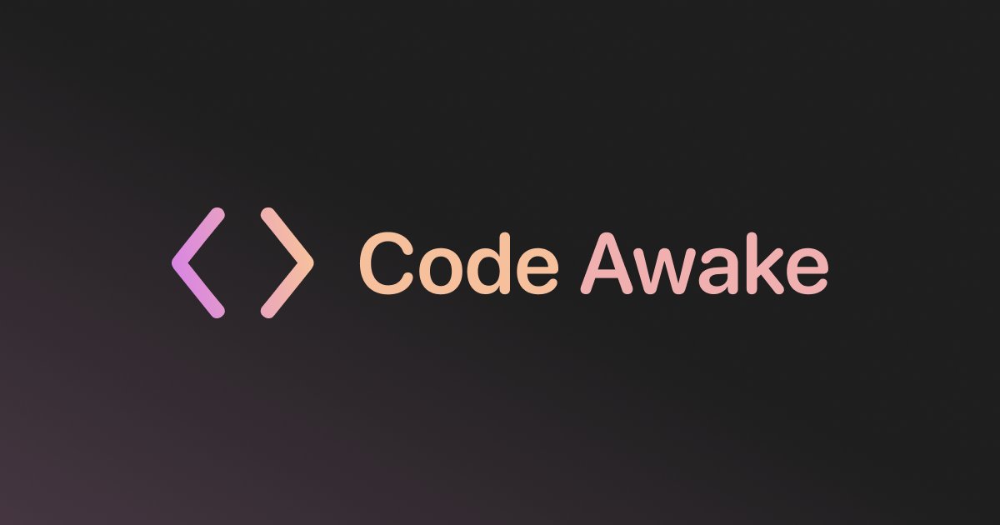

<p align="center">
  
</p>

<p align="center">
  <a href="https://github.com/artemsvit/Code-Awake/releases/latest/download/Code-Awake-1.0.6.dmg"><strong>Download for Mac</strong></a>
  <span> | </span>
  <a href="https://codeawake.artsvit.com">Website</a>
  <span> | </span>
  <a href="https://github.com/artemsvit/Code-Awake/releases/latest">Latest Release</a>
</p>

## Code Awake

Code Awake lives in the macOS menu bar and gives you one focused control for keeping your Mac awake. It is built for long-running downloads, remote access, builds, phone-based workflows, and any moment where the Mac should stay available without opening a full preferences app.

The app uses public Apple power-management APIs and Sparkle for direct-distribution updates.

## Highlights

| Feature | Details |
| --- | --- |
| Keep Mac Awake | Prevents idle system sleep and keeps network client sessions active. |
| Lock & Sleep | Optional display-sleep prevention; leave it off to follow your macOS dim, lock, and display-sleep timing. |
| Closed Lid Workflows | Best-effort support when macOS allows closed-lid wake behavior, such as supported clamshell conditions. |
| Auto Turn Off | Optional timer for turning awake mode off automatically. |
| Launch at Login | Starts Code Awake with macOS so the menu bar control is ready. |
| Sparkle Updates | Built-in update checks through a signed Sparkle appcast. |

## Installation

1. Download the latest DMG from the release page.
2. Drag `Code Awake.app` into `Applications`.
3. Launch Code Awake.
4. Use the menu bar cup icon to turn awake mode on or off.

## Distribution

Code Awake is distributed outside the Mac App Store with Developer ID signing and Apple notarization.

Release assets are published through GitHub Releases:

- DMG: `Code-Awake-1.0.6.dmg`
- Sparkle feed: `appcast.xml`

The current Sparkle feed URL is:

```text
https://github.com/artemsvit/Code-Awake/releases/latest/download/appcast.xml
```

## Build

```bash
xcodebuild -project "Code Awake.xcodeproj" -scheme "Code Awake" -configuration Debug build
```

For signed release packaging, keep signing values in your local shell or a private `.env` file. The release script loads `.env` automatically when it exists. Do not commit Apple certificates, App Store Connect keys, notary profiles, keychains, or personal signing IDs.

```bash
export CODE_AWAKE_TEAM_ID="YOURTEAMID"
export CODE_AWAKE_CERT_SIGN_IDENTITY="Developer ID Application: Your Name (YOURTEAMID)"
export CODE_AWAKE_NOTARY_PROFILE="YourNotaryProfile"
export CODE_AWAKE_SPARKLE_ACCOUNT="CodeAwake"
```

Then run:

```bash
./scripts/build_release_dmg.sh
./scripts/publish_github_release.sh
```

The release script builds the app, signs Sparkle helpers, creates the DMG, submits it for notarization, staples the ticket, generates the Sparkle appcast, and prepares GitHub Release assets. The script intentionally reads private signing details from environment variables instead of storing them in the repository.

## Requirements

- macOS 13.5 or later
- Xcode 26.5 or compatible local toolchain for development
- Developer ID certificate and configured `notarytool` profile for release packaging

## Public Repo Safety

This repository is intended to be safe for public open-source use. The tracked source may include public app metadata such as website URLs, bundle identifiers, Sparkle public keys, and release links, but it should not include private credentials.

Keep these files and values local only:

- Apple Developer certificates, `.p12`, `.cer`, `.p8`, provisioning profiles, and keychains
- `notarytool` credentials or keychain profile secrets
- GitHub tokens, API keys, passwords, and local `.env` files
- Local signing overrides such as `Config/LocalSigning.xcconfig`

Before publishing changes, run:

```bash
git status --short
git grep -n -I -E 'PRIVATE KEY|api[_-]?key|secret|token|password|keychain|notary|TEAM_ID|CERT'
```

## Support

For support, updates, and release downloads, visit:

```text
https://codeawake.artsvit.com
```
