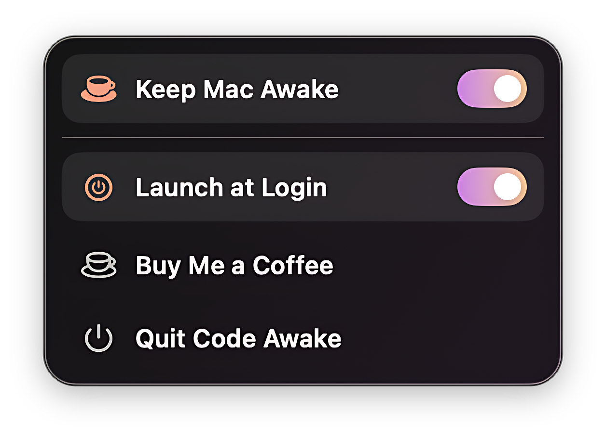

<p align="center">
  
</p>

<p align="center">
  A quiet macOS menu bar utility that keeps your Mac awake when your work needs to stay reachable.
</p>

<p align="center">
  <a href="https://github.com/artemsvit/Code-Awake/releases/latest/download/Code-Awake-1.0.dmg"><strong>Download for Mac</strong></a>
  <span> | </span>
  <a href="https://codeawake.artsvit.com">Website</a>
  <span> | </span>
  <a href="https://github.com/artemsvit/Code-Awake/releases/latest">Latest Release</a>
</p>

<p align="center">
  
</p>

## Code Awake

Code Awake lives in the macOS menu bar and gives you one focused control for keeping your Mac awake. It is built for long-running downloads, remote access, builds, phone-based workflows, and any moment where the Mac should stay available without opening a full preferences app.

The app uses public Apple power-management APIs and Sparkle for direct-distribution updates.

## Highlights

| Feature | Details |
| --- | --- |
| Keep Mac Awake | Prevents idle system sleep and display idle sleep while enabled. |
| Closed Lid Workflows | Best-effort support when macOS allows closed-lid wake behavior, such as supported clamshell conditions. |
| Auto Turn Off | Optional timer for turning awake mode off automatically. |
| Launch at Login | Starts Code Awake with macOS so the menu bar control is ready. |
| Sparkle Updates | Built-in update checks through a signed Sparkle appcast. |

## Menu Bar Design

<p align="center">
  
</p>

The interface is intentionally small: one menu bar icon, a native-feeling awake toggle, launch-at-login control, auto turn-off options, update check, donation link, and quit action.

## Installation

1. Download the latest DMG from the release page.
2. Drag `Code Awake.app` into `Applications`.
3. Launch Code Awake.
4. Use the menu bar cup icon to turn awake mode on or off.

## Distribution

Code Awake is distributed outside the Mac App Store with Developer ID signing and Apple notarization.

Release assets are published through GitHub Releases:

- DMG: `Code-Awake-1.0.dmg`
- Sparkle feed: `appcast.xml`

The current Sparkle feed URL is:

```text
https://github.com/artemsvit/Code-Awake/releases/latest/download/appcast.xml
```

## Build

```bash
xcodebuild -project "Code Awake.xcodeproj" -scheme "Code Awake" -configuration Debug build
```

For signed release packaging:

```bash
./scripts/build_release_dmg.sh
./scripts/publish_github_release.sh
```

The release script builds the app, signs Sparkle helpers, creates the DMG, submits it for notarization, staples the ticket, generates the Sparkle appcast, and prepares GitHub Release assets.

## Requirements

- macOS 13.5 or later
- Xcode 26.5 or compatible local toolchain for development
- Developer ID certificate and configured `notarytool` profile for release packaging

## Support

For support, updates, and release downloads, visit:

```text
https://codeawake.artsvit.com
```
